COVis: covid-19 Visualizations
================

(Source code: <https://github.com/b-lev/covid19-vis>)

# Main plot

Results below include up to 2020-04-03 for MA
\[<a href="https://github.com/b-lev/massachusetts-covid19-report-archive">src</a>\],
2020-04-03 for countries
\[<a href="https://github.com/CSSEGISandData/COVID-19">src</a>\], and
2020-04-03 for US states
\[<a href="https://covidtracking.com">src</a>\].

Related site:
<a href=https://www.wmasscovid.com>https://www.wmasscovid.com</a>.

Below is the most important plot. We want to be like S. Korea or lower.
This is a comparison of growth per capita, where “day 0” is approx
0.004% of the country’s population. This is a log scale, and so
exponential/viral growth is a straight line. The dashed grey lines show
epidemic growth when the fraction of infected population doubles every 2
days, or 3 days, etc.  
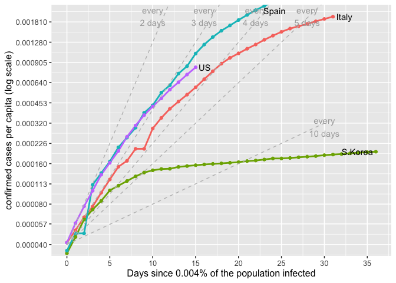<!-- -->

## Massachusetts Data

MA data from
<https://github.com/b-lev/massachusetts-covid19-report-archive>.

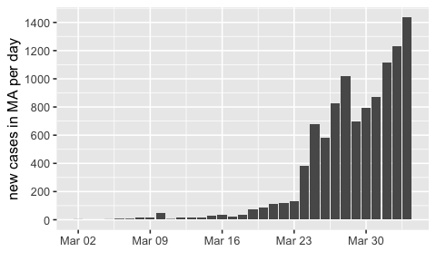<!-- -->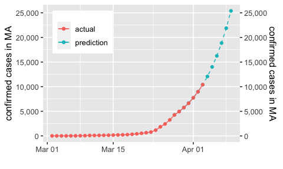<!-- -->

Death rate in MA.

<!-- -->

The cumulative fraction of MA covid patients that are hospitalized.

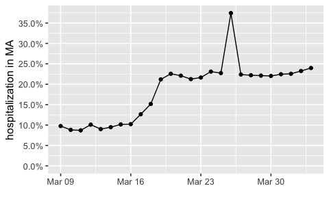<!-- -->

MA is performing an inadequate number of tests per day.

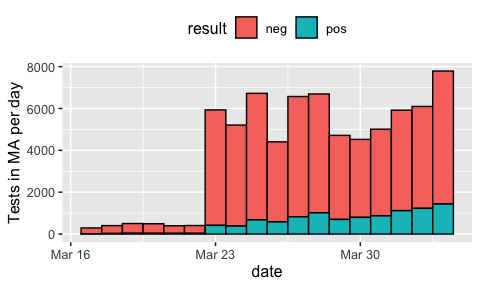<!-- -->

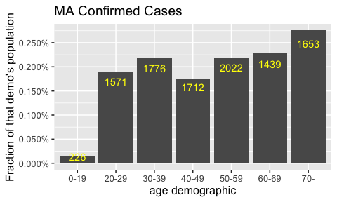<!-- -->

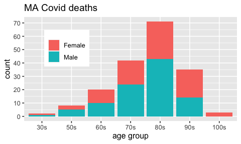<!-- -->

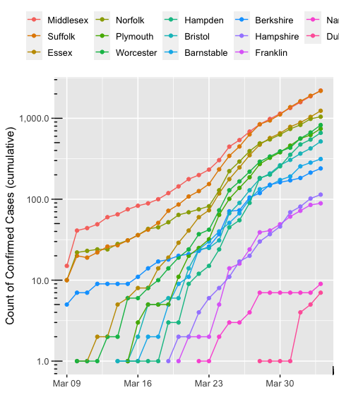<!-- -->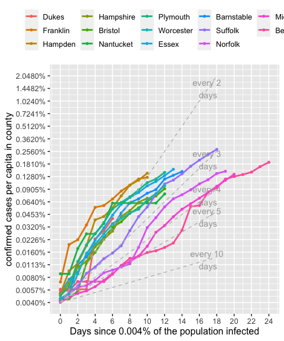<!-- -->

# US States

Deaths in the US.

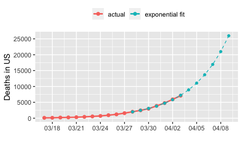<!-- -->

(Based on <https://covidtracking.com/api/states/daily.csv>.)

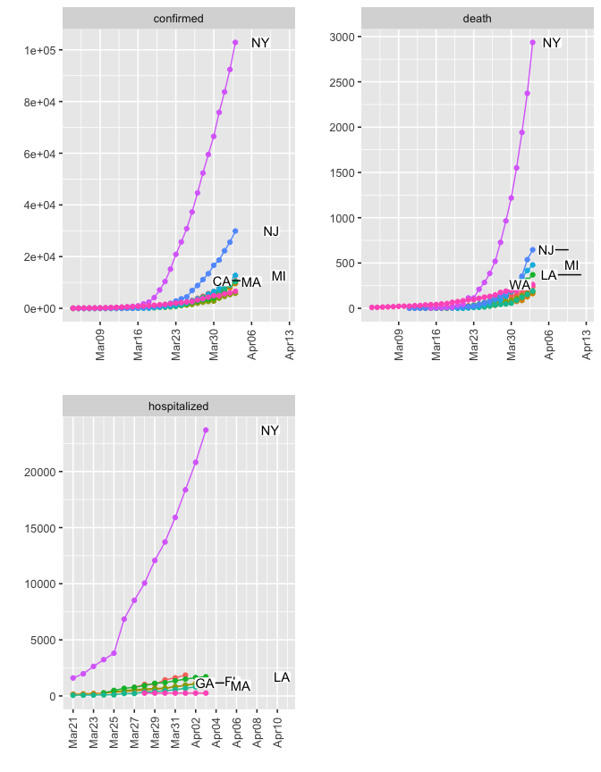<!-- -->

# US Testing Statistics

Testing in each state. Sometimes, health care workers are tested, to be
sure they are not infected. That is one explanation for why some states
show many negatives. (Based on
<https://covidtracking.com/api/states/daily.csv>.)

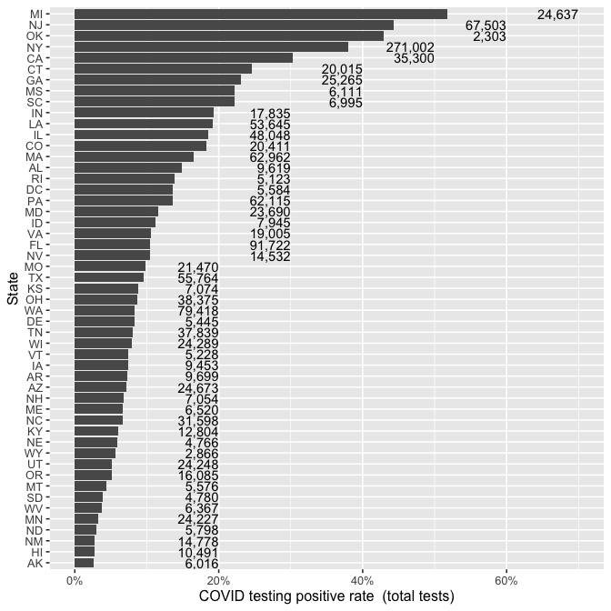<!-- -->

This plots show how long it is taking each state to test its population,
on a per capita basis. (I’m assuming, optimistically, that the test had
not be given to the same person twice.)

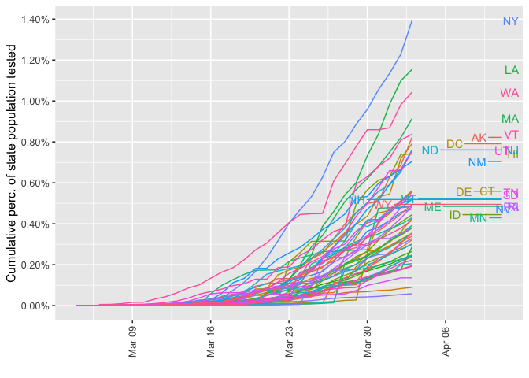<!-- -->

# World data

This plot shows the spread of the virus over time across the world. We
want the number of active cases to drop to zero, the deaths to stay as
low as possible, obviously, and the recovered cases to climb high.
Confirmed is a cumulative count of everyone that has tested positive.

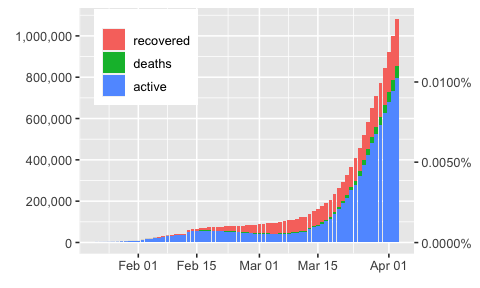<!-- -->

Here’s another view of the same data.

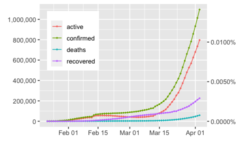<!-- -->

These plots show how the numbers have grown over time in each country.
All countries want to hit the bent curve that China has reported
achieving.

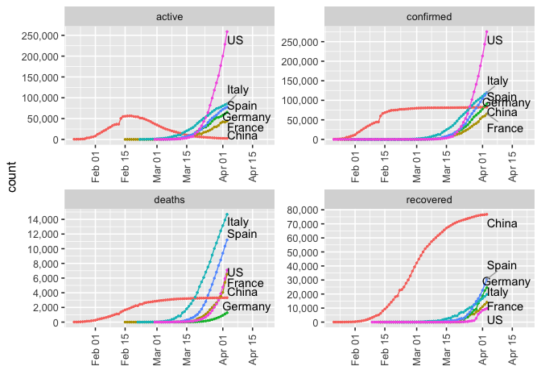<!-- -->

# World Fatality Rates

Here is a plot of the fatility rate. It’s really hard to tell whether
this analysis makes sense given the unreliablity of the data overall.
FWIW:

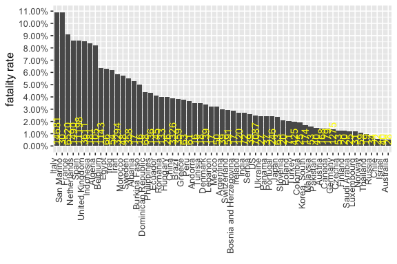<!-- -->

Thanks to JHU for the data
(<https://github.com/CSSEGISandData/COVID-19>). Results are only as good
as the data, which is only as good as the amount of testing done.

I hereby disclaim any and all representations and warranties with
respect to this data, including accuracy, fitness for use, and
merchantability. Reliance for medical guidance or use in commerce is
strictly prohibited.
